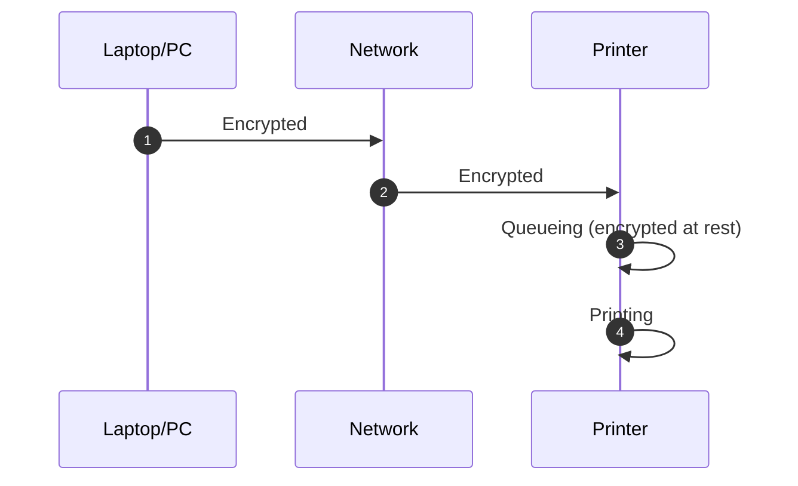
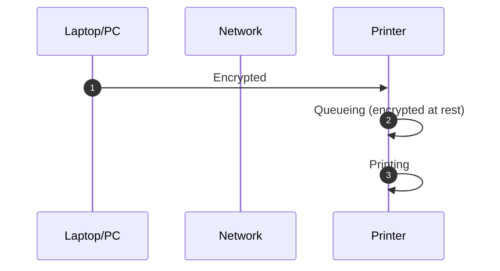

## Theory
For the process of FIPS-Validated printing, there are two primary scenarios. 
### Scenario A: Network Provides the Transport Encryption
The computer and printer both establish an encrypted connection with the network, and the network enables them to communicate with eachother in an encrypted manner. A technical implementation of this might be something like [802.1AE/MACSec](https://www.juniper.net/documentation/us/en/software/junos/security-services/topics/topic-map/understanding_media_access_control_security_qfx_ex.html)

### Scenario B: Transport Encryption is Provided by the Printer
The computer establishes an encrypted channel with the printer directly, over an unencrypted network. Technical implementations of this might include: IPP over HTTPS, IPSec, or a proprietary encrypted printing protocol.

This website focuses on Scenario B, but the printers listed here would be good candidates for Scenario A, as the printer still needs to be able to securely store the print jobs at rest.