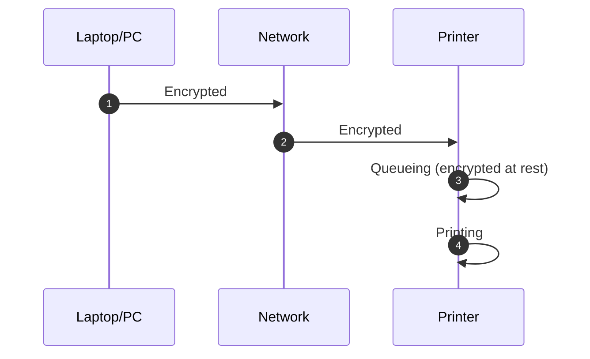
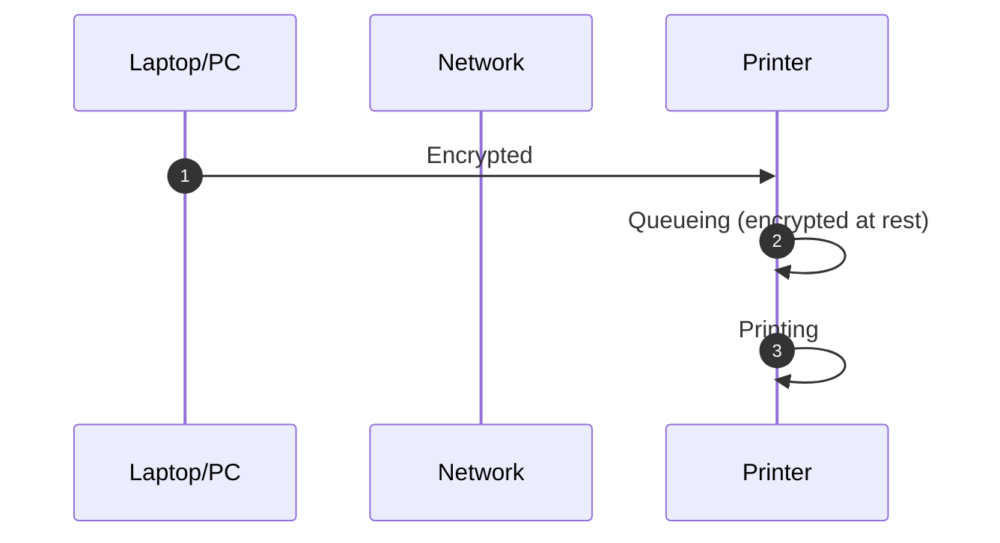

## Theory
For the process of FIPS-Validated printing, there are two primary scenarios. 
### Scenario A: Network Provides the Transport Encryption
The computer and printer both establish an encrypted connection with the network, and the network enables them to communicate with each other in an encrypted manner. A technical implementation of this might be something like [802.1AE/MACSec](https://www.juniper.net/documentation/us/en/software/junos/security-services/topics/topic-map/understanding_media_access_control_security_qfx_ex.html)

### Scenario B: Transport Encryption is Provided by the Printer
The computer establishes an encrypted channel with the printer directly, over an unencrypted network. Technical implementations of this might include: IPP over HTTPS, IPSec, or a proprietary encrypted printing protocol.

**This website focuses on Scenario B**, but the printers listed here would be good candidates for Scenario A, as the printer still needs to be able to securely store the print jobs 
at rest.

## Finding Printers
The FIPS-Validated printer search usually starts (well, let's be honest, it *starts* with a Google search for "FIPS-Validated Printers") with [NIAP](https://www.niap-ccevs.org/), the National Information Assurance Partnership which was established by NIST and NSA. NIAP has lists of Commercial Off-The-Shelf (COTS) products that have undergone testing and have been validated to pass a certain level of security requirements. NIAP calls these security requirements "Protection Profiles" 

### Protection Profiles
The NIAP protection profile for printers and MFPs is [Protection Profile for Hardcopy Devices Version 1.0](https://www.niap-ccevs.org/protectionprofiles/317) (PP_HCD_V1.0) which will be sunset on **10/23/2024**. 
The successor to PP_HCD_V1.0, is [collaborative Protection Profile for Hardcopy Devices Version 1.0E](https://www.niap-ccevs.org/protectionprofiles/483) (CPP_HCD_V1.0E) which will take effect on **10/23/2024** (Hard cutover).

Neither PP_HCD_V1.0 nor CPP_HCD_V1.0E mandates FIPS modules used for cryptography to be validated. 
The NIAP list of printers/MFPs under the "Hardcopy" protection profiles is not authoritative for all FIPS-Validated printers (especially since the profiles don't require FIPS valdiation) but this list is still a good list of pre-vetted products which are concious about security. There seems to be a high correlation between printers on the NIAP's list, and printers which have FIPS-Validated modules installed.
